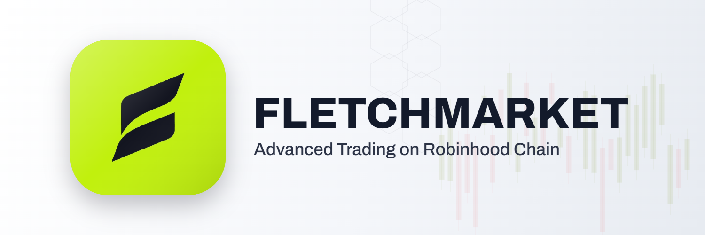

<div align="center">



<br/>

**Advanced trading terminal for Robinhood Chain**
Live markets · tokenized stocks · wallet portfolio · onchain data — in one screen.

[**Live → fletch.markets**](https://fletch.markets) · [Terminal](https://fletch.markets/terminal)

<sub>Independent & community-built — not affiliated with, endorsed by, or sponsored by Robinhood Markets, Inc.</sub>

</div>

---

## Overview

FLETCHMARKET is a real-time analytics terminal for **Robinhood Chain** (mainnet, chain id `4663`). It reads the network directly — the chain's RPC, its Blockscout explorer, and established market data providers — and brings prices, tokenized stocks, wallet portfolios, DeFi yields and onchain activity together in a single, fast interface. No account, no wallet required to browse.

## Features

- **Live crypto markets** — majors with real-time price, 24h change, market cap, volume and 7-day sparklines
- **TradingView-style charts** — real OHLC candlesticks with `1m · 15m · 1H · 4H · 1D · 1W` timeframes
- **Stocks** — every tokenized real-world equity and ETF issued on the chain (NVDA, TSLA, AAPL, MSFT and more) with live price, market cap and holders
- **Portfolio tracker** — paste any wallet (or connect a browser wallet) to read its real balances, tokens and transaction history, DeBank-style
- **Yield radar** — live stablecoin vault APY and TVL across leading curators
- **Chain activity** — real onchain token-transfer feed
- **Live network status** — block height and gas price straight from the chain RPC
- **Market alerts** — instant alerts when a tracked asset moves sharply
- **Wallet connect** — one click adds Robinhood Chain to your wallet with the official network parameters
- **Trade & Staking** — *coming soon* (onchain swaps and FLETCH staking, post token launch)

## Live data

| Data | Source | Refresh |
|---|---|---|
| Prices, 24h change, market cap, volume, sparklines | CoinGecko | 45s |
| Candlestick OHLC (all timeframes) | Binance market data | live |
| Tokenized stocks & ETFs (price, mcap, holders) | Blockscout explorer | 60s |
| Block height, gas price, wallet balances | Robinhood Chain RPC | live |
| Token list, wallet tokens, transactions, activity | Blockscout explorer | live |
| Vault APY & TVL | DeFiLlama | 5m |

Every figure is read live from its source. If the network can't reach a provider, that panel says so instead of showing stale numbers.

## Network parameters

| | |
|---|---|
| Chain | Robinhood Chain (Mainnet) |
| Chain ID | `4663` (`0x1237`) |
| Gas token | ETH |
| Public RPC | `https://rpc.mainnet.chain.robinhood.com` |
| Explorer | `https://robinhoodchain.blockscout.com` |
| Stack | Arbitrum L2 on Ethereum |

## Tech

Plain **HTML · CSS · JavaScript** — no framework, no build step. Fast, portable, and trivially deployable to any static host. Scripts are classic (non-module) and load in dependency order from `terminal.html`.

```
fletchmarket/
├── index.html            # Landing page
├── terminal.html         # The app (Markets · Stocks · Portfolio · Vaults · Chain activity · Alerts · Docs)
├── assets/
│   ├── favicon.svg
│   ├── brand/            # Logo marks, lockups, banner
│   ├── css/              # landing.css · terminal.css
│   └── js/
│       ├── config.js     # Chain IDs, RPC, explorer & data endpoints
│       ├── core.js       # Helpers, navigation, live chain status, wallet connect
│       ├── markets.js    # Live markets, table, movers, candlestick chart
│       ├── stocks.js     # Tokenized equities & ETFs
│       ├── widgets.js    # Vault yields, chain activity, alerts
│       ├── chain-tokens.js
│       ├── portfolio.js  # Wallet portfolio tracker
│       └── landing.js
├── vercel.json
└── LICENSE
```

## Run locally

Any static server works:

```bash
npm run dev                 # serves on http://localhost:5173
# or
python3 -m http.server 5173
```

Then open `http://localhost:5173` — landing at `/`, the terminal at `/terminal`.

## Deployment

Deployed on **Vercel** as a static site (zero config; `vercel.json` enables clean URLs and asset caching). Any static host — Cloudflare Pages, Netlify, GitHub Pages — works the same way.

## Roadmap

- [ ] **Trade** — onchain buy/sell (swaps) via a verified Robinhood Chain DEX
- [ ] **Staking** — stake FLETCH for rewards and premium features
- [ ] Onchain AMM price feeds → premium-gap (onchain vs CEX) signal
- [ ] Watchlists & saved wallets

## Disclaimer

FLETCHMARKET is an independent analytics tool and is **not** affiliated with, endorsed by, or sponsored by Robinhood Markets, Inc. All data is informational and nothing here is financial advice. Crypto assets and tokenized securities are highly volatile — never invest more than you can afford to lose.

## License

[MIT](LICENSE)
